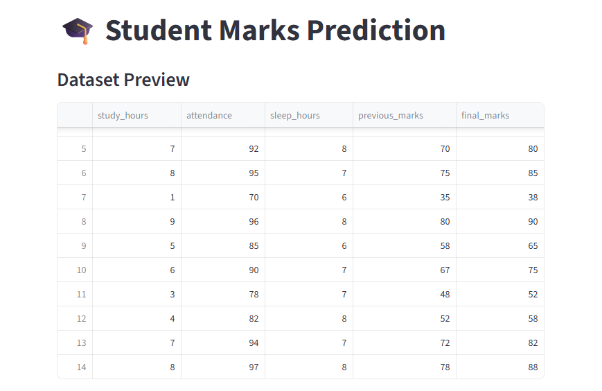
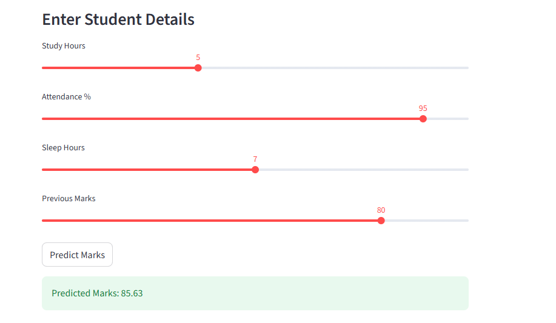
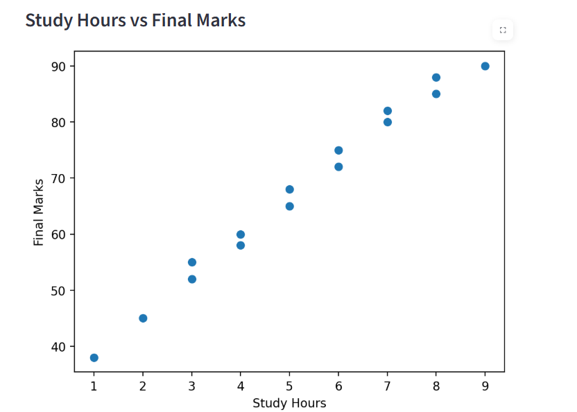

# 🎓 Student Marks Prediction

A Machine Learning project that predicts student marks based on study habits and academic factors using Linear Regression.

## 📌 Project Overview

This project predicts student performance using multiple features:

- 📚 Study Hours
- 📅 Attendance Percentage
- 😴 Sleep Hours
- 📝 Previous Marks

The model is trained using Scikit-Learn and deployed with Streamlit for an interactive user experience.


## 🚀 Features

✅ Predict student marks instantly  
✅ Interactive Streamlit web app  
✅ Data visualization using Matplotlib  
✅ Machine Learning using Linear Regression  
✅ Model evaluation metrics (MAE and R² Score)


## 🛠 Technologies Used

- Python
- Pandas
- Scikit-Learn
- Streamlit
- Matplotlib


## 📂 Project Structure

```
student-marks-prediction/
│── app.py
│── student_data.csv
│── requirements.txt
│── README.md
│── home.png
│── prediction.png
│── graph.png
```


## 📊 Input Features

| Feature | Description |
|----------|-------------|
| Study Hours | Number of study hours |
| Attendance | Attendance percentage |
| Sleep Hours | Daily sleep hours |
| Previous Marks | Previous exam marks |


## ▶ How to Run

### 1. Clone Repository

```bash
git clone YOUR_GITHUB_REPOSITORY_LINK
```

### 2. Install Dependencies

```bash
pip install -r requirements.txt
```

### 3. Run Application

```bash
streamlit run app.py
```


## 📈 Model Performance

Evaluation metrics used:

- Mean Absolute Error (MAE)
- R² Score


## 🖥 Example Prediction

Input:

```
Study Hours: 5
Attendance: 95%
Sleep Hours: 7
Previous Marks: 80
```

Output:

```
Predicted Marks: 85.63
```


## 📷 Demo Screenshots

### Home Page



### Prediction Result



### Data Visualization




## 🚀 Live Demo

[Open Student Marks Prediction App](https://student-marks-prediction-le6an9ynyxrnnfklfrbjal.streamlit.app/)
## 🎯 Future Improvements

- Add more student performance factors
- Compare multiple ML models
- Deploy application online
- Improve dataset size


## 👩‍💻 Author

Neha M

Beginner AI/ML Project 🚀
